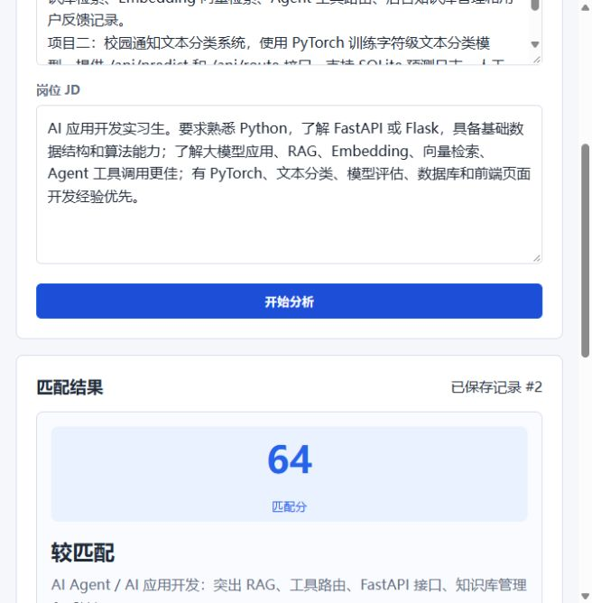
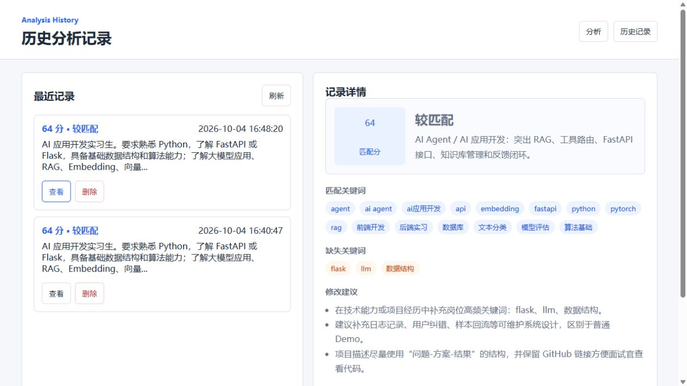

# 智能简历匹配与岗位分析系统

一个面向学生求职场景的 AI 应用项目：输入简历文本和岗位 JD，系统自动计算匹配度，提取岗位关键词，识别简历缺失能力，并给出修改建议。

这个项目可以作为 AI Agent 的前置分析模块，也可以独立用于简历优化、岗位分析和求职准备。

## 页面预览

### 简历与岗位匹配分析



### 历史分析记录



## 功能特性

- 简历与岗位 JD 匹配度评分
- 岗位关键词抽取与简历关键词抽取
- 匹配关键词、缺失关键词对比
- 根据岗位方向生成简历修改建议
- 根据 JD 自动判断适合强调的方向，例如 AI Agent、NLP、后端工程化
- SQLite 保存历史分析记录
- 历史记录页面支持查看和删除
- FastAPI 提供可调用接口
- 前端页面可直接输入文本并查看分析结果

## 技术栈

- 后端：Python、FastAPI、Pydantic
- 数据库：SQLite
- 前端：HTML、CSS、JavaScript
- 算法：关键词抽取、文本向量化、余弦相似度、规则路由

## 项目亮点

- 不只是展示页面，而是包含 API、数据库、前端、历史记录的完整闭环
- 默认不依赖外部大模型 API Key，便于本地运行和面试演示
- 预留 Embedding/RAG 扩展方向，可升级为 OpenAI Embedding、sentence-transformers、FAISS 或 Chroma
- 和 AI 应用开发实习岗位强相关，适合写进简历项目经历

## 快速开始

```bash
pip install -r requirements.txt
uvicorn app.main:app --reload --port 8020
```

访问：

- 分析页面：http://127.0.0.1:8020/
- 历史记录：http://127.0.0.1:8020/history
- API 文档：http://127.0.0.1:8020/docs

## API 示例

### 分析简历与 JD

```http
POST /api/analyze
Content-Type: application/json

{
  "resume_text": "熟悉 Python、FastAPI、PyTorch，做过 RAG 和 Agent 工具路由项目...",
  "jd_text": "AI 应用开发实习生，要求熟悉 Python、FastAPI、RAG、Embedding、Agent..."
}
```

返回核心字段：

```json
{
  "score": 82,
  "level": "高度匹配",
  "matched_keywords": ["python", "fastapi", "rag", "agent"],
  "missing_keywords": ["embedding"],
  "suggestions": ["在技术能力或项目经历中补充岗位高频关键词：embedding。"]
}
```

### 查看历史记录

```http
GET /api/history
```

### 删除历史记录

```http
DELETE /api/history/{analysis_id}
```

## 项目结构

```text
resume-jd-matcher/
├── app/
│   ├── analyzer.py      # 匹配算法、关键词抽取、建议生成
│   ├── database.py      # SQLite 数据访问
│   └── main.py          # FastAPI 入口
├── static/
│   ├── index.html       # 分析页面
│   ├── history.html     # 历史记录页面
│   ├── app.js
│   ├── history.js
│   └── styles.css
├── data/                # 本地 SQLite 数据库目录
├── requirements.txt
└── README.md
```

## 后续可扩展

- 接入 OpenAI Embedding 或 sentence-transformers
- 使用 FAISS/Chroma 保存 JD 与简历向量
- 支持 PDF/DOCX 简历解析
- 支持批量岗位 JD 分析与岗位推荐
- 接入 AI Agent，自动生成更完整的简历修改稿
